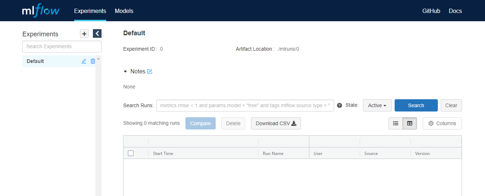
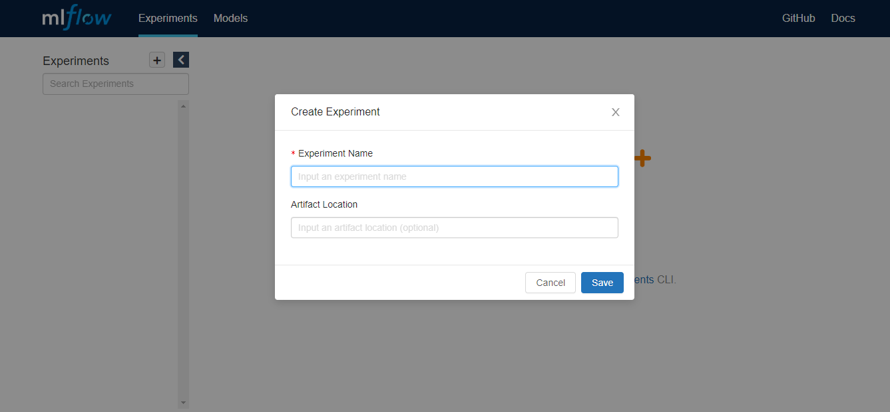
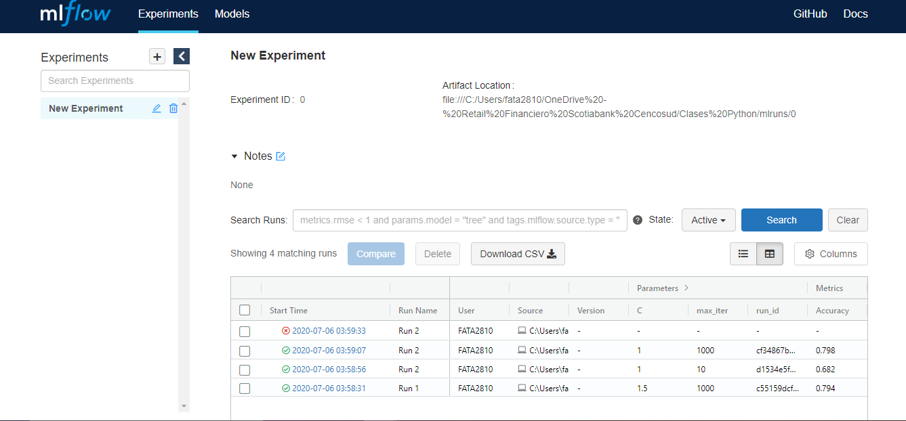
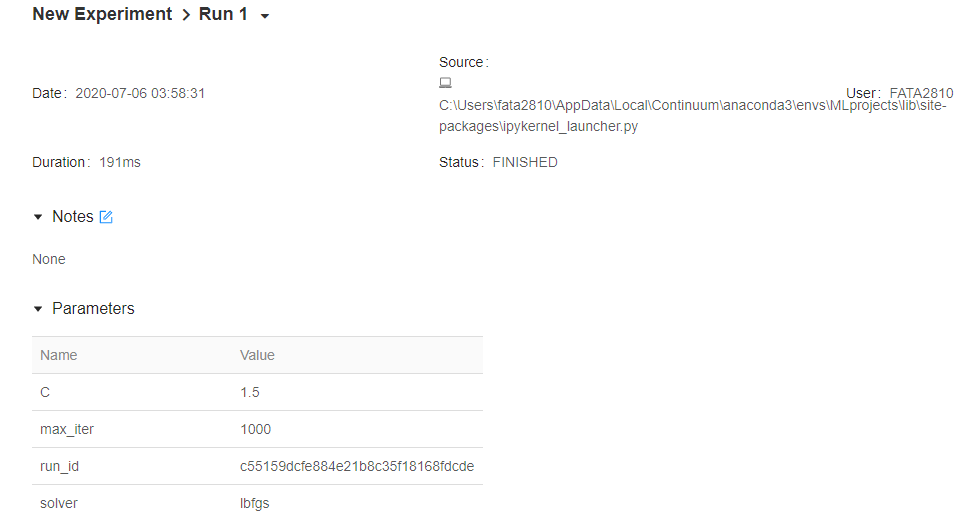
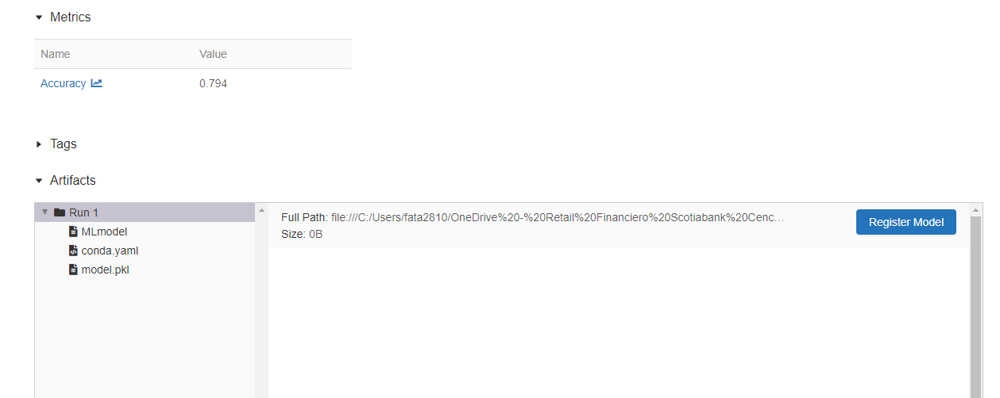

# How to use MLflow

I have to say that I love modeling, but at the same time it demands the best of me in terms of being organized. I´m a mess, and that definitely is not helpful when modeling. So I had to put lots of efforts on creating my own folder system that helps me to organize my code, my data and my outputs. But even having all of that there is something I couldn't managed to organize and those are my experiments. 

When trying to come up with a model, is all about trial and error. You never know priorly what type of model, what type of preprocessing, feature engineering or whatever other hyperparameter will be the ones that will provide the best performing model. The thing is, how to organize your notebooks, and know exactly what combination of hyperparameters you used to get the best results.

Here is where MLflow comes into play, providing a way to have everything organized into a nice UI. I have to say, I have never used MLflow before and at the same time I´ve never found a good tutorial that helps me understand in detail how this thing works.

My idea is to test some of its functionalities by myself and with time come up with a confortable workflow that help to organize my code and my models in a better way.

So first things first. Installing this thing was quite easy by using `pip install mlflow`. Then, by running `mlflow ui` into conda you will serve a UI in the following link: http://localhost:5000 that looks like this:



I have no idea how to use it. So I will keep playing around with it. In order to test out this thing, I will again use the [titanic dataset](https://www.kaggle.com/c/titanic/data).


```python
import pandas as pd
import numpy as np

df = pd.read_csv('train.csv')
df.head()
```


<div>
<style scoped>
    .dataframe tbody tr th:only-of-type {
        vertical-align: middle;
    }

    .dataframe tbody tr th {
        vertical-align: top;
    }

    .dataframe thead th {
        text-align: right;
    }
</style>
<table border="1" class="dataframe">
  <thead>
    <tr style="text-align: right;">
      <th></th>
      <th>PassengerId</th>
      <th>Survived</th>
      <th>Pclass</th>
      <th>Name</th>
      <th>Sex</th>
      <th>Age</th>
      <th>SibSp</th>
      <th>Parch</th>
      <th>Ticket</th>
      <th>Fare</th>
      <th>Cabin</th>
      <th>Embarked</th>
      <th>Signing_date</th>
    </tr>
  </thead>
  <tbody>
    <tr>
      <th>0</th>
      <td>1</td>
      <td>0</td>
      <td>3</td>
      <td>Braund, Mr. Owen Harris</td>
      <td>male</td>
      <td>22.0</td>
      <td>1</td>
      <td>0</td>
      <td>A/5 21171</td>
      <td>7.2500</td>
      <td>NaN</td>
      <td>S</td>
      <td>1911-05-17</td>
    </tr>
    <tr>
      <th>1</th>
      <td>2</td>
      <td>1</td>
      <td>1</td>
      <td>Cumings, Mrs. John Bradley (Florence Briggs Th...</td>
      <td>female</td>
      <td>38.0</td>
      <td>1</td>
      <td>0</td>
      <td>PC 17599</td>
      <td>71.2833</td>
      <td>C85</td>
      <td>C</td>
      <td>1911-07-23</td>
    </tr>
    <tr>
      <th>2</th>
      <td>3</td>
      <td>1</td>
      <td>3</td>
      <td>Heikkinen, Miss. Laina</td>
      <td>female</td>
      <td>26.0</td>
      <td>0</td>
      <td>0</td>
      <td>STON/O2. 3101282</td>
      <td>7.9250</td>
      <td>NaN</td>
      <td>S</td>
      <td>1911-09-08</td>
    </tr>
    <tr>
      <th>3</th>
      <td>4</td>
      <td>1</td>
      <td>1</td>
      <td>Futrelle, Mrs. Jacques Heath (Lily May Peel)</td>
      <td>female</td>
      <td>35.0</td>
      <td>1</td>
      <td>0</td>
      <td>113803</td>
      <td>53.1000</td>
      <td>C123</td>
      <td>S</td>
      <td>1911-06-26</td>
    </tr>
    <tr>
      <th>4</th>
      <td>5</td>
      <td>0</td>
      <td>3</td>
      <td>Allen, Mr. William Henry</td>
      <td>male</td>
      <td>35.0</td>
      <td>0</td>
      <td>0</td>
      <td>373450</td>
      <td>8.0500</td>
      <td>NaN</td>
      <td>S</td>
      <td>1911-10-25</td>
    </tr>
  </tbody>
</table>
</div>


Initially I will only Impute Nulls and will encode categories as ordinal numbers. This approach is simplistic and not necessarily the best but I just want to make a model work with this data.


```python
df.isnull().sum()
```


    PassengerId       0
    Survived          0
    Pclass            0
    Name              0
    Sex               0
    Age             177
    SibSp             0
    Parch             0
    Ticket            0
    Fare              0
    Cabin           687
    Embarked          2
    Signing_date      0
    dtype: int64


According to this, I will impute `Age` with its mean. I will drop `Cabin` and `Signing_date`, and Impute `Embarked` with its Mode.

> Note: `Signing_date` is a fake variable I created for other side project I have. Please disregard.


```python
mean_age = df.Age.mean()
mode_embarked = df.Embarked.mode()
mean_fare = df.Fare.mean()

import category_encoders as ce

def make_data_ready(data):
    result = (data.fillna(value = {'Age': mean_age, 'Embarked': mode_embarked, 'Fare': mean_fare})
        .drop(columns = ['Cabin','Signing_date'], errors = 'ignore')
        .set_index('PassengerId')
     )
    
    ord = ce.OrdinalEncoder()
    out = ord.fit_transform(result)
    return out

df = make_data_ready(df)
df.head()
```


<div>
<style scoped>
    .dataframe tbody tr th:only-of-type {
        vertical-align: middle;
    }

    .dataframe tbody tr th {
        vertical-align: top;
    }

    .dataframe thead th {
        text-align: right;
    }
</style>
<table border="1" class="dataframe">
  <thead>
    <tr style="text-align: right;">
      <th></th>
      <th>Survived</th>
      <th>Pclass</th>
      <th>Name</th>
      <th>Sex</th>
      <th>Age</th>
      <th>SibSp</th>
      <th>Parch</th>
      <th>Ticket</th>
      <th>Fare</th>
      <th>Embarked</th>
    </tr>
    <tr>
      <th>PassengerId</th>
      <th></th>
      <th></th>
      <th></th>
      <th></th>
      <th></th>
      <th></th>
      <th></th>
      <th></th>
      <th></th>
      <th></th>
    </tr>
  </thead>
  <tbody>
    <tr>
      <th>1</th>
      <td>0</td>
      <td>3</td>
      <td>1</td>
      <td>1</td>
      <td>22.0</td>
      <td>1</td>
      <td>0</td>
      <td>1</td>
      <td>7.2500</td>
      <td>1</td>
    </tr>
    <tr>
      <th>2</th>
      <td>1</td>
      <td>1</td>
      <td>2</td>
      <td>2</td>
      <td>38.0</td>
      <td>1</td>
      <td>0</td>
      <td>2</td>
      <td>71.2833</td>
      <td>2</td>
    </tr>
    <tr>
      <th>3</th>
      <td>1</td>
      <td>3</td>
      <td>3</td>
      <td>2</td>
      <td>26.0</td>
      <td>0</td>
      <td>0</td>
      <td>3</td>
      <td>7.9250</td>
      <td>1</td>
    </tr>
    <tr>
      <th>4</th>
      <td>1</td>
      <td>1</td>
      <td>4</td>
      <td>2</td>
      <td>35.0</td>
      <td>1</td>
      <td>0</td>
      <td>4</td>
      <td>53.1000</td>
      <td>1</td>
    </tr>
    <tr>
      <th>5</th>
      <td>0</td>
      <td>3</td>
      <td>5</td>
      <td>1</td>
      <td>35.0</td>
      <td>0</td>
      <td>0</td>
      <td>5</td>
      <td>8.0500</td>
      <td>1</td>
    </tr>
  </tbody>
</table>
</div>


Then, the only thing that´s left is splitting the data into Train and validation. Again, simple approach just to show more MLflow features.


```python
from sklearn.model_selection import train_test_split

X_train, X_val, y_train, y_val = train_test_split(df.drop(columns = 'Survived'), df.Survived, test_size = 0.25, random_state = 123)
```

# Time to Model

After spending more than 3 hours reading the documentation because some things didn´t work as expected (There is a high chance that I´m not smart enough and I couldn't understand the really well organized [documentation](https://www.mlflow.org/docs/latest/index.html) I managed to figure out how to make this thing to work. So the first recommended thing is to create an experiment. This can be done directly in the UI by clicing the `+` sign in the top left corner, which is nice:



Or it can be done by commands, that is my prefered choice:


```python
import mlflow
mlflow.set_experiment(experiment_name = 'New Experiment')
```

    INFO: 'New Experiment' does not exist. Creating a new experiment
    

This command is quite nice, because it will create a experiment in case it doesn't exist, or it will set the experiment as your active experiment in case it exists. So even though there is a `.create_experiment()` function, I prefer this.

Then the logic MLflow has is super straight forward. Once you have an experiment you open a Run, the best way to this is using `mlflow.start_run()` as a context manager. That way once the indented block is done the run automatically closes, no need to call `mlflow.end_run()`.

> `mlflow` is the high level API which helps making easier, but some of tits functionalities can be little bit cumbersome when you have no experience, like in my case. The pros about this API is that all of the IDs will be created automatically, which is good since you'll not be overwriting things if you forgot to change an ID, but the cons are that IDs are extremely not human readable and hard to access. In case you´ll want to control everything manually you'll have to go to the `mlflow.tracking` which is low level.

Ok, so once this is clear the logic is easy, in an open run you can log things, such as:

   * parameters: Model Hyperparameters or anything you want to track from your current notebook. Normally these things are given.
   * metrics: This is more related to the model and are values that are measurable, such as performance metrics.
   * artifacts: It can be any file you want to attach to your model. It can be your data, it can be a chart, images, etc.
   * models: This is the model as such, that will be serialized into a .pkl file. This functionality will have a separate API for every model flavor such as: `mlflow.sklearn` for sklearn models, `mlflow.xgboost` for xgboost models and you get the idea.
   
In this example, I'll run a simple Logistic Regression, in which I will like to save some parameters such as: solver, C, and max_iter. I will open 3 Runs:


```python
from sklearn.linear_model import LogisticRegression
import mlflow
import mlflow.sklearn
C = 1.5
max_iter = 1000
name = 'Run 1'

with mlflow.start_run(run_name = name) as run:
    
    lr = LogisticRegression(solver = 'lbfgs', random_state = 123, max_iter = max_iter, C = C)
    lr.fit(X_train,y_train)
    acc = lr.score(X_val,y_val)  
    
    mlflow.log_param("run_id", run.info.run_id)
    mlflow.log_param("solver", 'lbfgs')
    mlflow.log_param("max_iter", max_iter)
    mlflow.log_param("C", C)

    mlflow.log_metric("Accuracy", acc)
    mlflow.sklearn.log_model(lr, name)
```

The code above was run several times, and the results can be seen in the UI as follows:



4 Runs were run. Every run automatically logs the Startting time. Right next to it there is a green or red icon indicating if the run was succesful or not. Also the Run can be logged with a Run Name which is optional, but I recommend it, because it is the only way to recognize what is your Run about. You will see that all the parameters using the `.log_param()` are there as well as the metrics logged with `.log_metric()`. One thing to note is that the Run name can be repeated because the unique identifier of every run is the run_id which is automatically created.

I found this run_id is particularly difficult to get with the current API, and define it manually carries some other issues I don't want to deal with. That is why is super important that when running the Run you add `mlflow.log_param("run_id", run.info.run_id)` to store the run id. This will be really helpful to get access to other functionalities of the UI.

Now, if you click in one of the Runs you go to another View like this:



In this first part you'll get the logged parameters plus Info regarding the start run, the duration of the run, which is quite nice to avoid the `%%time` magic commands, and the status.



And there is another interesting part that shows the metrics and the artifacts. In our case we have only logged the model that as you can see is stored as a .pkl file.


There are some other commands that are quite handy to get access to the logged objects. The first one is `mlflow.get_experiment_by_name()`. I think this is important because It will provide the most important info about your experiment, namely the experiment_id.
The format of this information is super complicated to deal with so I recommmend to convert it into a dictionary like this:


```python
dict(mlflow.get_experiment_by_name('New Experiment'))
```


    {'artifact_location': 'file:///C:/Users/fata2810/OneDrive%20-%20Retail%20Financiero%20Scotiabank%20Cencosud/Clases%20Python/mlruns/0',
     'experiment_id': '0',
     'lifecycle_stage': 'active',
     'name': 'New Experiment',
     'tags': {}}


Some other important commands are based in the `mlflow.tracking` API such as `.get_run()` that will provide the info about the runs and `.list_run_infos` that will retrieve basically all the run_ids but in a really ugly way. 

> Note: Always remember the experiment_id is a string, even if they look as an integer.

th `mlflow.tracking` API works like this:


```python
from mlflow.tracking import MlflowClient

client = MlflowClient()
client.list_run_infos(experiment_id = '0')
```


    [<RunInfo: artifact_uri='file:///C:/Users/fata2810/OneDrive%20-%20Retail%20Financiero%20Scotiabank%20Cencosud/Clases%20Python/mlruns/0/86ba898ad44049edb55203166cfab227/artifacts', end_time=1594022373954, experiment_id='0', lifecycle_stage='active', run_id='86ba898ad44049edb55203166cfab227', run_uuid='86ba898ad44049edb55203166cfab227', start_time=1594022373922, status='FAILED', user_id='FATA2810'>,
     <RunInfo: artifact_uri='file:///C:/Users/fata2810/OneDrive%20-%20Retail%20Financiero%20Scotiabank%20Cencosud/Clases%20Python/mlruns/0/cf34867bb1ee45bc9755446eba6e073e/artifacts', end_time=1594022347517, experiment_id='0', lifecycle_stage='active', run_id='cf34867bb1ee45bc9755446eba6e073e', run_uuid='cf34867bb1ee45bc9755446eba6e073e', start_time=1594022347331, status='FINISHED', user_id='FATA2810'>,
     <RunInfo: artifact_uri='file:///C:/Users/fata2810/OneDrive%20-%20Retail%20Financiero%20Scotiabank%20Cencosud/Clases%20Python/mlruns/0/d1534e5faf7642faa0f028bdaf68a6bd/artifacts', end_time=1594022336377, experiment_id='0', lifecycle_stage='active', run_id='d1534e5faf7642faa0f028bdaf68a6bd', run_uuid='d1534e5faf7642faa0f028bdaf68a6bd', start_time=1594022336288, status='FINISHED', user_id='FATA2810'>,
     <RunInfo: artifact_uri='file:///C:/Users/fata2810/OneDrive%20-%20Retail%20Financiero%20Scotiabank%20Cencosud/Clases%20Python/mlruns/0/c55159dcfe884e21b8c35f18168fdcde/artifacts', end_time=1594022312153, experiment_id='0', lifecycle_stage='active', run_id='c55159dcfe884e21b8c35f18168fdcde', run_uuid='c55159dcfe884e21b8c35f18168fdcde', start_time=1594022311962, status='FINISHED', user_id='FATA2810'>]


```python
client.get_run(run_id = 'c55159dcfe884e21b8c35f18168fdcde')
```


    <Run: data=<RunData: metrics={'Accuracy': 0.7937219730941704}, params={'C': '1.5',
     'max_iter': '1000',
     'run_id': 'c55159dcfe884e21b8c35f18168fdcde',
     'solver': 'lbfgs'}, tags={'mlflow.log-model.history': '[{"run_id": "c55159dcfe884e21b8c35f18168fdcde", '
                                 '"artifact_path": "Run 1", "utc_time_created": '
                                 '"2020-07-06 07:58:32.125378", "flavors": '
                                 '{"python_function": {"loader_module": '
                                 '"mlflow.sklearn", "python_version": "3.7.7", '
                                 '"data": "model.pkl", "env": "conda.yaml"}, '
                                 '"sklearn": {"pickled_model": "model.pkl", '
                                 '"sklearn_version": "0.22.2.post1", '
                                 '"serialization_format": "cloudpickle"}}}]',
     'mlflow.runName': 'Run 1',
     'mlflow.source.name': 'C:\\Users\\fata2810\\AppData\\Local\\Continuum\\anaconda3\\envs\\MLprojects\\lib\\site-packages\\ipykernel_launcher.py',
     'mlflow.source.type': 'LOCAL',
     'mlflow.user': 'FATA2810'}>, info=<RunInfo: artifact_uri='file:///C:/Users/fata2810/OneDrive%20-%20Retail%20Financiero%20Scotiabank%20Cencosud/Clases%20Python/mlruns/0/c55159dcfe884e21b8c35f18168fdcde/artifacts', end_time=1594022312153, experiment_id='0', lifecycle_stage='active', run_id='c55159dcfe884e21b8c35f18168fdcde', run_uuid='c55159dcfe884e21b8c35f18168fdcde', start_time=1594022311962, status='FINISHED', user_id='FATA2810'>>


I think the most important feature that mlflow provides is the ability to store models as .pkl files and then be able to retrieve them. I think this is not very well explained in the documentation, and I wasted a lot of time understanding the correct way to this properly, so here it goes:

First you need to import the flavor of your model, in my case a sklearn model, hence `import mlflow.sklearn`. Then the documentation describes the usage of `mlflow.sklearn.load_models()` with a URI in the following form:

'runs:/<run_id>/relative_path_to_models'.

Put into easy words the URI works like this:

* The run id can be obtained from the UI or using the commands shown above.
The relative path will be the information provided in the second argument of `mlflow.sklearn.log_model(lr, name)`. This argument name, will create a folder with the same "name". Remember that the variable name took the same value as the Run Name. 


```python
import mlflow.sklearn
model_lr = mlflow.sklearn.load_model(f'runs:/c55159dcfe884e21b8c35f18168fdcde/Run 1') #Run 1 is the name of the first experiment
model_lr
```


    LogisticRegression(C=1.5, class_weight=None, dual=False, fit_intercept=True,
                       intercept_scaling=1, l1_ratio=None, max_iter=1000,
                       multi_class='auto', n_jobs=None, penalty='l2',
                       random_state=123, solver='lbfgs', tol=0.0001, verbose=0,
                       warm_start=False)


As you can see, now the LR model was retrieved and can be used normally since it is loaded into the Python environment.

This was a brief introduction to MLflow. Even though the tool is super intuitive and easy to use it was really difficult to understand how to make it work because there are not many tutorials out there, and the docs although they are super well organized doesn't provide code examples that for me are the best way to understand how this works.

I will be uploading some other example with more advanced functionalities if I manage to understand them.

Best,
