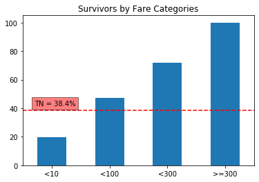

# Creating reusable plotting Functions

In my new job I´ve noticed they like to explain variables impact into some target in the following way:


Normally we have a natural Rate of an Event happening shown as this TN dashed line. And you have a particular variable that is splitted into Categories showing what is the specific Rate of the Event by Category. 

Since this is happening so often, I decided to build a simple function to avoid all the work behind the scenes. In order to show this, I will use the well-known Titanic dataset from Kaggle, which can be downloaded from [here](https://www.kaggle.com/c/titanic/data).

So first of all. let´s import the data:


```python
import pandas as pd
df = pd.read_csv('train.csv')
df.head()
```


<div>
<style scoped>
    .dataframe tbody tr th:only-of-type {
        vertical-align: middle;
    }

    .dataframe tbody tr th {
        vertical-align: top;
    }

    .dataframe thead th {
        text-align: right;
    }
</style>
<table border="1" class="dataframe">
  <thead>
    <tr style="text-align: right;">
      <th></th>
      <th>PassengerId</th>
      <th>Survived</th>
      <th>Pclass</th>
      <th>Name</th>
      <th>Sex</th>
      <th>Age</th>
      <th>SibSp</th>
      <th>Parch</th>
      <th>Ticket</th>
      <th>Fare</th>
      <th>Cabin</th>
      <th>Embarked</th>
      <th>Signing_date</th>
    </tr>
  </thead>
  <tbody>
    <tr>
      <th>0</th>
      <td>1</td>
      <td>0</td>
      <td>3</td>
      <td>Braund, Mr. Owen Harris</td>
      <td>male</td>
      <td>22.0</td>
      <td>1</td>
      <td>0</td>
      <td>A/5 21171</td>
      <td>7.2500</td>
      <td>NaN</td>
      <td>S</td>
      <td>1911-05-17</td>
    </tr>
    <tr>
      <th>1</th>
      <td>2</td>
      <td>1</td>
      <td>1</td>
      <td>Cumings, Mrs. John Bradley (Florence Briggs Th...</td>
      <td>female</td>
      <td>38.0</td>
      <td>1</td>
      <td>0</td>
      <td>PC 17599</td>
      <td>71.2833</td>
      <td>C85</td>
      <td>C</td>
      <td>1911-07-23</td>
    </tr>
    <tr>
      <th>2</th>
      <td>3</td>
      <td>1</td>
      <td>3</td>
      <td>Heikkinen, Miss. Laina</td>
      <td>female</td>
      <td>26.0</td>
      <td>0</td>
      <td>0</td>
      <td>STON/O2. 3101282</td>
      <td>7.9250</td>
      <td>NaN</td>
      <td>S</td>
      <td>1911-09-08</td>
    </tr>
    <tr>
      <th>3</th>
      <td>4</td>
      <td>1</td>
      <td>1</td>
      <td>Futrelle, Mrs. Jacques Heath (Lily May Peel)</td>
      <td>female</td>
      <td>35.0</td>
      <td>1</td>
      <td>0</td>
      <td>113803</td>
      <td>53.1000</td>
      <td>C123</td>
      <td>S</td>
      <td>1911-06-26</td>
    </tr>
    <tr>
      <th>4</th>
      <td>5</td>
      <td>0</td>
      <td>3</td>
      <td>Allen, Mr. William Henry</td>
      <td>male</td>
      <td>35.0</td>
      <td>0</td>
      <td>0</td>
      <td>373450</td>
      <td>8.0500</td>
      <td>NaN</td>
      <td>S</td>
      <td>1911-10-25</td>
    </tr>
  </tbody>
</table>
</div>


This dataset is intended to find survival rate of passengers depending of the features associated to them. In this case the Target variable is `Survived`. If we want to understand the Surviving rate we can just simply use `.value_counts()` to get those numbers.


```python
df.Survived.value_counts(normalize = True)
```


    0    0.616162
    1    0.383838
    Name: Survived, dtype: float64


We can notice that 61% of passengers did not survived, but is there any difference when we take subsets of the data? For example does the survival rate change when analizing by sex? We expect so:


```python
df.groupby(['Sex']).Survived.value_counts(normalize = True)
```


    Sex     Survived
    female  1           0.742038
            0           0.257962
    male    0           0.811092
            1           0.188908
    Name: Survived, dtype: float64


Actually, when splitting by Sex we notice that 74% of women survived whereas only 18% of men survived. So is there a good way to plot this? So our aim will be to show only survival rate (because death rate is just the complement) and show how that compares to the Natural Survival Rate:

# The Trick

The first trick is that since Survived is a binary variable, it is possible to get the same survival rates, but only for the "1"  doing the following:


```python
df.groupby('Sex').Survived.mean()
```


    Sex
    female    0.742038
    male      0.188908
    Name: Survived, dtype: float64


This can be easily plot using `pandas.plot()`


```python
import matplotlib.pyplot as plt
df.groupby('Sex').Survived.mean().plot(kind = 'bar')
plt.show()
```


I will create the `plot_rate_by()` in order to make this interesting and be very flexible. Also this will add some other functionalities such as adding titles and allow this for any dataset:


```python
def plot_rate_by(data,by,Target, TN, title, x, y, x_label = None, rot = 0):
    TN *=100 # converts to percentage
    # plots ading title, and optional label rotation
    ax = (data.groupby(by)[Target].mean()*100).plot(kind = 'bar', title = title, rot = rot) 
    plt.axhline(TN, color = 'r', linestyle = '--') # adds dashed line
    # adds the red text box, in coordinates x and y to avoid overlapping
    plt.text(x,y,f'TN = {TN}%',bbox=dict(facecolor='red', alpha=0.5)) 
    ax.set_xlabel(x_label) # optional Label for the x Axis
    return plt.show()
    
```

So now, it is just  matter of tun the function with the parameters and that's it.


```python
import numpy as np
# Natural Rate for survivors
tn = np.round(df.Survived.value_counts(normalize = True).loc[1],3) 
plot_rate_by(df, by = 'Sex', Target = 'Survived', TN = tn, 
  title = 'Survivors by Sex', x = 0.4, y = 40, x_label = None)
```


And it can be done for any categorical variable, for example, `Pclass`:


```python
plot_rate_by(df, by = 'Pclass', Target = 'Survived', TN = tn, title = 'Survivors by Pclass', x = 1.6, y = 40, x_label = None)
```


Another thing that normally happens at my job is that they want to do this with variables that are continous. This cannot be done directly, so it is necessary to create some binning. This can be done easily. Let´s say we want to use Fare. So what is the Survival rate for people paying cheaper tickets, let´s say <10, or some other values <100, <300 and >=300. In order to this I will use `numpy.select`.

I think numpy select is not very self explanatory. Basically works as a case when in which you have to define a condition list, boolean masks, and a choice list with vallues when condition is met.


```python
condlist = [df.Fare < 10, df.Fare < 100, df.Fare < 300, df.Fare >= 300] # list of conditions
choicelist = ['<10','<100','<300','>=300']

df['Fare_binning'] = np.select(condlist, choicelist)
df[['Fare','Fare_binning']]
```


<div>
<style scoped>
    .dataframe tbody tr th:only-of-type {
        vertical-align: middle;
    }

    .dataframe tbody tr th {
        vertical-align: top;
    }

    .dataframe thead th {
        text-align: right;
    }
</style>
<table border="1" class="dataframe">
  <thead>
    <tr style="text-align: right;">
      <th></th>
      <th>Fare</th>
      <th>Fare_binning</th>
    </tr>
  </thead>
  <tbody>
    <tr>
      <th>0</th>
      <td>7.2500</td>
      <td>&lt;10</td>
    </tr>
    <tr>
      <th>1</th>
      <td>71.2833</td>
      <td>&lt;100</td>
    </tr>
    <tr>
      <th>2</th>
      <td>7.9250</td>
      <td>&lt;10</td>
    </tr>
    <tr>
      <th>3</th>
      <td>53.1000</td>
      <td>&lt;100</td>
    </tr>
    <tr>
      <th>4</th>
      <td>8.0500</td>
      <td>&lt;10</td>
    </tr>
    <tr>
      <th>...</th>
      <td>...</td>
      <td>...</td>
    </tr>
    <tr>
      <th>886</th>
      <td>13.0000</td>
      <td>&lt;100</td>
    </tr>
    <tr>
      <th>887</th>
      <td>30.0000</td>
      <td>&lt;100</td>
    </tr>
    <tr>
      <th>888</th>
      <td>23.4500</td>
      <td>&lt;100</td>
    </tr>
    <tr>
      <th>889</th>
      <td>30.0000</td>
      <td>&lt;100</td>
    </tr>
    <tr>
      <th>890</th>
      <td>7.7500</td>
      <td>&lt;10</td>
    </tr>
  </tbody>
</table>
<p>891 rows × 2 columns</p>
</div>


Well normally you don't know priorly what are good binnings to show your data so this type of operation needs to be extremely flexible. How can this transform into a function?
Let´s say we have a list of tha boundary values:


```python
vals_l = [10,100,300]
```

A for loop can be used to use this values into conditions using `.lt()` method and creating the choices:


```python
condlist = []
choicelist = []
#Doing this operation for every boundary
for v in vals_l:
    condlist.append(df['Fare'].lt(v)) # data['Fare'].lt(v) is equivalent to data.Fare < v
    choicelist.append('<'+str(v)) #concatening boundary and the < sign

```

Additionally, it is necessary to add the last category for the >=. This can be done as:


```python
condlist.append(df['Fare'].ge(vals_l[-1]))
choicelist.append('>='+str(vals_l[-1]))

choicelist
```


    ['<10', '<100', '<300', '>=300']


It can be seen that all of the categories has been correctly created. Now putting all together into a function will look like this:


```python
def convert_to_range(data, field, vals_l):
    vals_l = vals_l
    condlist = []
    choicelist = []
    for v in vals_l:
        condlist.append(data[field].lt(v))
        choicelist.append('<'+str(v))
    
    condlist.append(data[field].ge(vals_l[-1]))
    choicelist.append('>='+str(vals_l[-1]))
    return pd.Categorical(np.select(condlist, choicelist), categories=choicelist, ordered = True) #converts everything into a pandas categorical variable
```


```python
df['binning_function'] = convert_to_range(df,'Fare',vals_l)
df[['Fare_binning','binning_function']]
```


<div>
<style scoped>
    .dataframe tbody tr th:only-of-type {
        vertical-align: middle;
    }

    .dataframe tbody tr th {
        vertical-align: top;
    }

    .dataframe thead th {
        text-align: right;
    }
</style>
<table border="1" class="dataframe">
  <thead>
    <tr style="text-align: right;">
      <th></th>
      <th>Fare_binning</th>
      <th>binning_function</th>
    </tr>
  </thead>
  <tbody>
    <tr>
      <th>0</th>
      <td>&lt;10</td>
      <td>&lt;10</td>
    </tr>
    <tr>
      <th>1</th>
      <td>&lt;100</td>
      <td>&lt;100</td>
    </tr>
    <tr>
      <th>2</th>
      <td>&lt;10</td>
      <td>&lt;10</td>
    </tr>
    <tr>
      <th>3</th>
      <td>&lt;100</td>
      <td>&lt;100</td>
    </tr>
    <tr>
      <th>4</th>
      <td>&lt;10</td>
      <td>&lt;10</td>
    </tr>
    <tr>
      <th>...</th>
      <td>...</td>
      <td>...</td>
    </tr>
    <tr>
      <th>886</th>
      <td>&lt;100</td>
      <td>&lt;100</td>
    </tr>
    <tr>
      <th>887</th>
      <td>&lt;100</td>
      <td>&lt;100</td>
    </tr>
    <tr>
      <th>888</th>
      <td>&lt;100</td>
      <td>&lt;100</td>
    </tr>
    <tr>
      <th>889</th>
      <td>&lt;100</td>
      <td>&lt;100</td>
    </tr>
    <tr>
      <th>890</th>
      <td>&lt;10</td>
      <td>&lt;10</td>
    </tr>
  </tbody>
</table>
<p>891 rows × 2 columns</p>
</div>


We can check that results are identical, and now this can be easily applied to any continuos variable. 
The lesson here is, I´m lazy I don´t want to things everytime, so I do it well once and then I recycle the functions.

Now the `plot_rate_by()` function can be used:


```python
plot_rate_by(df, by = 'binning_function', Target = 'Survived', TN = tn, title = 'Survivors by Fare Categories', x = -0.3, y = 42, x_label = None)
```





Hope you like this. And can be useful to understand that being lazy is good if this makes you a recycler. Not sure if this sounds OK but anyways.
